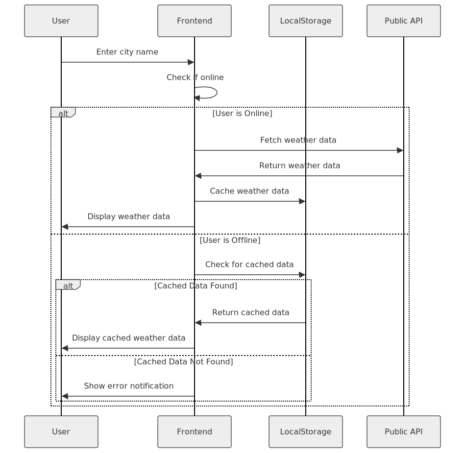

# Weather Prediction App - Frontend

## Overview

The Weather Prediction App is a user-friendly, responsive platform that provides a 3-day weather forecast for any city. The app is built using React with TypeScript, styled with Tailwind CSS, and optimized for performance and usability. It includes features such as weather-specific safety advice and caching functionality to improve user experience.

---

## Features

- **3-Day Weather Forecast**: Displays temperature, weather conditions, and safety advice.
- **Caching with LocalStorage**: Stores weather data to enable offline search.
- **Real-time Updates**: Fetches the latest weather data from the backend service.
- **Interactive Visuals**: Uses `react-icons` for visually appealing weather representations.
- **Error Handling**: Provides clear notifications for network issues or invalid input.
- **Responsive Design**: Ensures a seamless experience across all devices.

---

## Design and Implementation Approach

### 1. **Frontend Architecture**

The app uses a modular component-based structure. Key elements include:

- **Components**: Reusable UI components such as `WeatherCard`, `AdviceBox`, and `SearchBar`.
- **State Management**: Uses React's `useState` and `useEffect` hooks to manage weather data and API interactions.
- **Helper Functions**: Implements utilities for formatting dates, managing local storage, and mapping weather data to icons.
- **Styling**: Tailwind CSS ensures a clean, responsive, and consistent design.

### 2. **Backend Integration**

The frontend communicates with the Spring Boot backend on `api.kundanseal.site` through REST API endpoints. Data is processed and displayed dynamically based on user input.

### 3. **Caching Mechanism**

Weather data is cached in localStorage to continue search experience in offline mode and improve user experience. If cached data is available and valid, it is used instead of making a new API request only when the user is offline.

### 4. **Testing**

Jest is used for unit testing React components to ensure robustness and prevent regressions.

---

## Sequence Diagram

Below is the sequence diagram illustrating the user interaction flow:



---

## Design Patterns Used

### 1. **Singleton Pattern**

Used for managing a single instance of services like API requests and toast notifications.

### 2. **Observer Pattern**

React hooks (`useEffect`) observe state changes and trigger updates in the UI automatically.

### 3. **Factory Pattern**

Helper functions like `getWeatherIcon` act as factories for producing specific icons based on input weather conditions.

### 4. **Modular Design**

Components are designed as self-contained, reusable modules, promoting scalability and maintainability.

---

## Setup and Deployment

### Prerequisites

- Node.js installed.
- Docker (optional, for containerized deployment).

### Steps to Run Locally

1. Clone the repository:
   ```bash
   git clone https://github.com/your-repo/weather-frontend.git
   ```
2. Install dependencies:
   ```bash
   npm install
   ```
3. Start the development server:
   ```bash
   npm start
   ```

## Available Scripts

In the project directory, you can run:

### `npm start`

Runs the app in the development mode.\
Open [http://localhost:3000](http://localhost:3000) to view it in the browser.

The page will reload if you make edits.\
You will also see any lint errors in the console.

### `npm test`

Launches the test runner in the interactive watch mode.\
See the section about [running tests](https://facebook.github.io/create-react-app/docs/running-tests) for more information.

### `npm run build`

Builds the app for production to the `build` folder.\
It correctly bundles React in production mode and optimizes the build for the best performance.

The build is minified and the filenames include the hashes.\
Your app is ready to be deployed!

See the section about [deployment](https://facebook.github.io/create-react-app/docs/deployment) for more information.

### `npm run eject`

**Note: this is a one-way operation. Once you `eject`, you can’t go back!**

If you aren’t satisfied with the build tool and configuration choices, you can `eject` at any time. This command will remove the single build dependency from your project.

Instead, it will copy all the configuration files and the transitive dependencies (webpack, Babel, ESLint, etc) right into your project so you have full control over them. All of the commands except `eject` will still work, but they will point to the copied scripts so you can tweak them. At this point you’re on your own.

You don’t have to ever use `eject`. The curated feature set is suitable for small and middle deployments, and you shouldn’t feel obligated to use this feature. However we understand that this tool wouldn’t be useful if you couldn’t customize it when you are ready for it.
